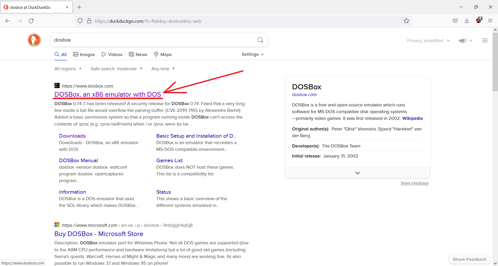
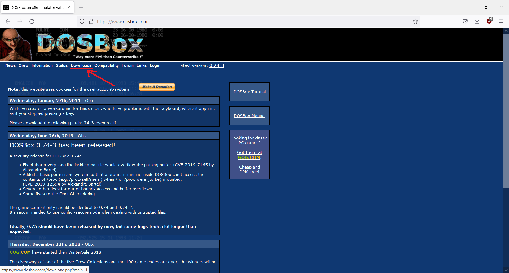
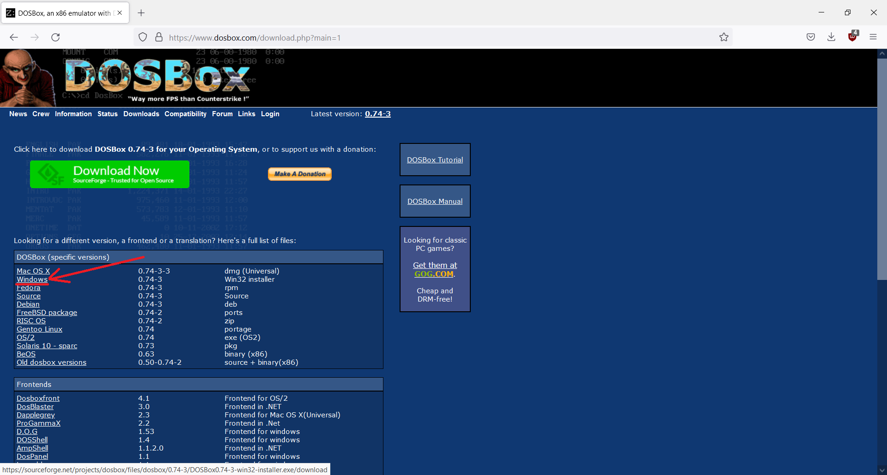
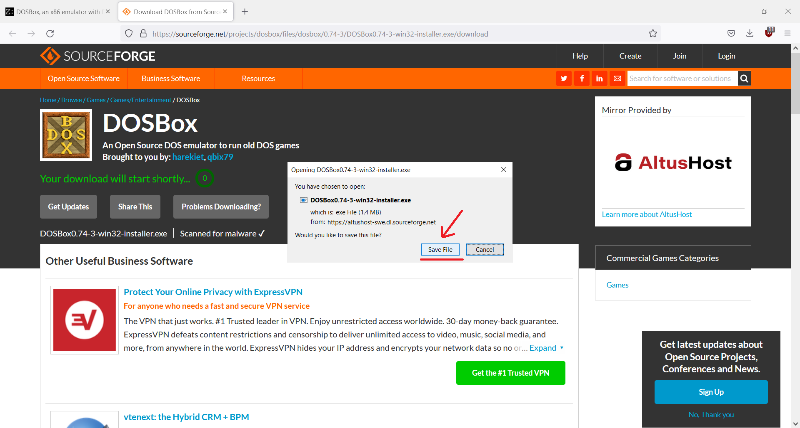
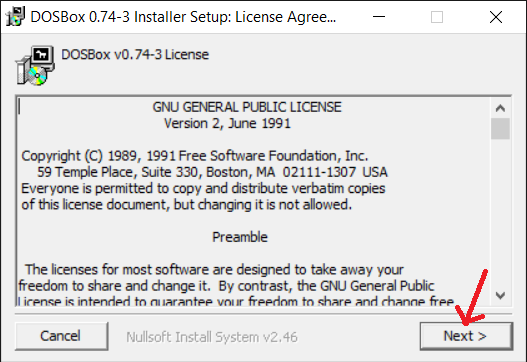
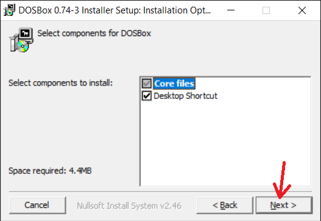
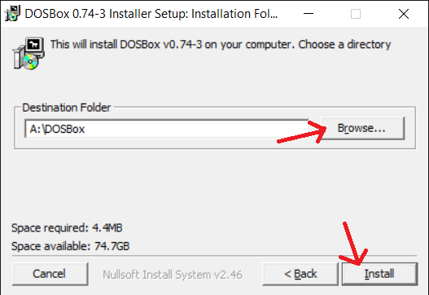
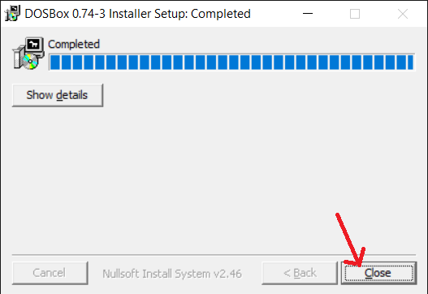

## Установка DOSBox

[На главную](../README.md)

Устанавливаем [DOSBox](https://www.dosbox.com/):

1. Ищем в поиске и переходим на сайт.

    

1. Жмём `Downloads`.

    

1. Жмём `Windows`.

    

1. Скачиваем установщик.

    

1. Жмём `Next >`.

    

1. Жмём `Next >`.

    

1. Выбираем директорию установки и жмём `Install`.

    

1. Жмём `Close`.

    
    
1. Ярлык запуска на рабочем столе или через исполняемый файл `DOSBox.exe` в папке установки.
