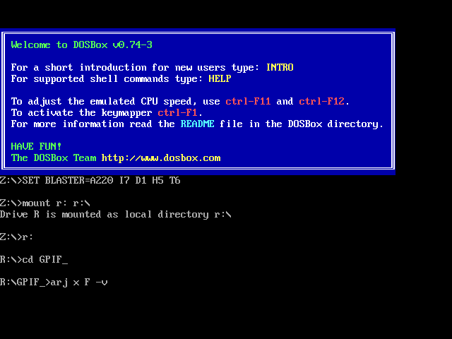
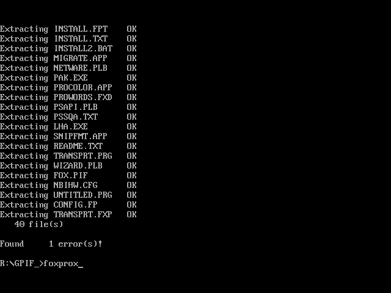
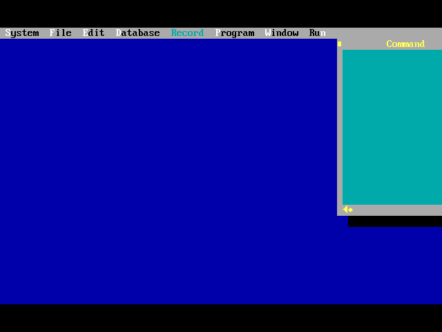

## Установка foxprox

[На главную](../README.md)

1. В свою папку `fiof_` копируем файл `U:/VT&PM/EU_EI/PIN/arm_f26/ARJ.EXE`.
1. В свою папку `fiof_` копируем файл `U:/VT&PM/EU_EI/PIN/arm_f26/F.ARJ`.
1. В свою папку `fiof_` копируем файл `U:/VT&PM/EU_EI/PIN/arm_f26/F.A01`.
1. В свою папку `fiof_` копируем файл `U:/VT&PM/EU_EI/PIN/arm_f26/F.A02`.
1. Открываем `DOSBox`.
1. Прописываем команды в `DOSBox`:
    ```bash
    mount r: r:\
    r:
    cd FIOF_            # Вот та папка fiof_
    arj x F -v          # Тут мы разархировали, где F - это наш архив F.ARJ, arj - это ARJ.EXE
    n
    n
    y
    y
    foxprox
    ```
    
    

    

    

    

    

    

1. При открытии `foxprox` жмем на кнопку `< Cancel >`.

    
1. Работаем в `foxprox`.

    
