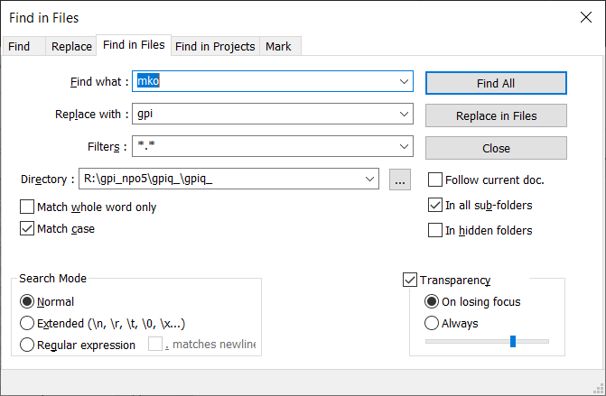
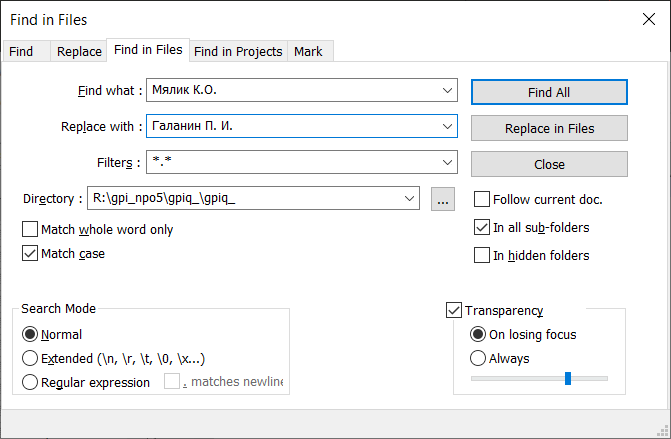

## Как переименовать

### Берём чужой проект
1. Переименовываем папку `fioq_` на `gpiq_`.
2. Расспаковываем `gpiq_/mkoq_.zip` в `gpiq_/`.

### Переименовываем файл
1. В папке `gpiq_` запускаем скприпт:
    ```bash
    python gpiq_autorename.py
    ```

### Переименовываем переменные и классы
1. Запускаем `notepad++`.
2. Жмём `Search` > `Find in files...`.
3. Заменяем `Mko` на `Gpi`
    
    

4. Заменяем `mko` на `gpi`.
    
    

5. Заменяем `Мялик К. О.` на `Галанин П. И.`.
    
    

6. Заменяем `D:/3-Kypc-ProgII/NPO` на `R:/gpi_npo5/gpiq_`.

### Заменяем английские слова на русские
1. Запускаем `notepad++`.
1. Жмём `Search` > `Find in files...`.
---
1. Заменяем `vixod iz sistemi` на `выход из системы`.
---
1. Заменяем `soxranenie sistemi` на ` сохранение системы`.
1. Заменяем `vosstanovlenie sistemi` на ` восстановление системы`.
1. Заменяем `vedenie arxivov` на `ведение архивов`.
---
1. Заменяем `soprovojdenie kartotek(spravochnikov)` на `сопровождение картотек (справочников)`.
1. Заменяем `tipovie operacii (TXO)` на `типовые операции (ТХО)`.
1. Заменяем `nastroika ARMa` на `настройка АРМ'a`.
---
1. Заменяем `opredelenie otchetnix form` на `определение отчётных форм`.
1. Заменяем `oborotno-saldovaa vedomost` на `оборотно-сальдова ведомость`.
1. Заменяем `Mialik K.O.` на `Galanin P. I.`.
1. Заменяем `balansovaa vedomost` на `балансовая ведомость`.
1. Заменяем `formivrovanie balansovoi otchetnosti` на `формирование балансовой отчётности`.
---
1. Заменяем `registracionnii jurnal (RJ)` на ` регистрационный журнал (РЖ)`.
1. Заменяем `formirovanie knigi schetov iz reg jurnala` на ` формирование книги счетов из регистрационного журнала`.
1. Заменяем `kniga schetov (KS)` на ` книга счетов (КС)`.
1. Заменяем `rabota c regjurnalom i knigoi cchev` на `работа с регистрационным журналом и книгой счетов`.
---
1. Заменяем `vvod tekuchey dati` на ` ввод текущей даты`.
1. Заменяем `vvod i raznoska pervixnogo dokumenta (KPD)` на ` ввод и разноска первичного документа (КПД)`.
1. Заменяем `vvod i raznoska pervixnix dokumentov` на `ввод и разноска первичных документов`.
---
1. Заменяем `vibrat` на `Выбрать`.
1. Заменяем `nazad` на `Назад`.
1. Заменяем `vpered` на `Вперёд`.
1. Заменяем `dobavit` на `Добавить`.
1. Заменяем `udalit` на `Удалить`.
1. Заменяем `vixod` на `Выход`.
---
1. Заменяем `балансовая ведомость` на `!!!балансовая ведомость`.
1. Заменяем `jurnal-order` на `!!!jurnal-order`.

1. Заменяем `сохранение системы` на `!!!сохранение системы`.
1. Заменяем `восстановление системы` на `!!!восстановление системы`.
