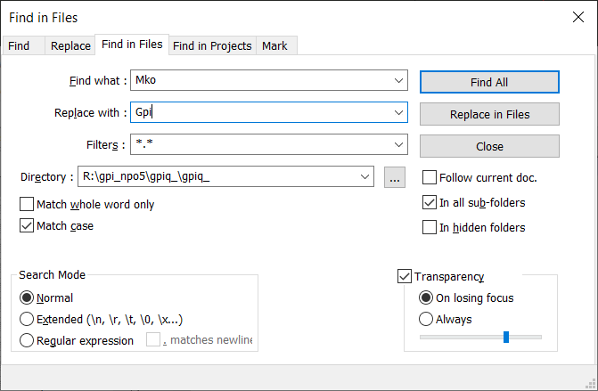

## Как переименовать

### Берём чужой проект
1. Переименовываем папку `fioq_` на `gpiq_`.
2. Расспаковываем `gpiq_/mkoq_.zip` в `gpiq_/`.

### Переименовываем файл
1. В папке `gpiq_` запускаем скприпт:
    ```bash
    python gpiq_autorename.py
    ```

### Переименовываем переменные и классы
1. Запускаем `notepad++`.
2. Жмём `Search` > `Find in files...`.
3. Заменяем `Mko` на `Gpi`
    
    

4. Заменяем `mko` на `gpi`.
    
    

5. Заменяем `Мялик К. О.` на `Галанин П. И.`.
    
    

6. Заменяем `D:/3-Kypc-ProgII/NPO` (~на `R:/gpi_npo5/gpiq_`~) на `./`.

### Заменяем английские слова на русские
1. Запускаем `notepad++`.
1. Жмём `Search` > `Find in files...`.
---
1. Заменяем `vixod iz sistemi` на `выход из системы`.
---
1. Заменяем `soxranenie sistemi` на ` сохранение системы`.
1. Заменяем `vosstanovlenie sistemi` на ` восстановление системы`.
1. Заменяем `vedenie arxivov` на `ведение архивов`.
---
1. Заменяем `soprovojdenie kartotek(spravochnikov)` на `сопровождение картотек (справочников)`.
1. Заменяем `tipovie operacii (TXO)` на `типовые операции (ТХО)`.
1. Заменяем `nastroika ARMa` на `настройка АРМ'a`.
---
1. Заменяем `opredelenie otchetnix form` на `определение отчётных форм`.
1. Заменяем `oborotno-saldovaa vedomost` на `оборотно-сальдова ведомость`.
1. Заменяем `Mialik K.O.` на `Galanin P. I.`.
1. Заменяем `balansovaa vedomost` на `балансовая ведомость`.
1. Заменяем `formivrovanie balansovoi otchetnosti` на `формирование балансовой отчётности`.
---
1. Заменяем `registracionnii jurnal (RJ)` на ` регистрационный журнал (РЖ)`.
1. Заменяем `formirovanie knigi schetov iz reg jurnala` на ` формирование книги счетов из регистрационного журнала`.
1. Заменяем `kniga schetov (KS)` на ` книга счетов (КС)`.
1. Заменяем `rabota c regjurnalom i knigoi cchev` на `работа с регистрационным журналом и книгой счетов`.
---
1. Заменяем `vvod tekuchey dati` на ` ввод текущей даты`.
1. Заменяем `vvod i raznoska pervixnogo dokumenta (KPD)` на ` ввод и разноска первичного документа (КПД)`.
1. Заменяем `vvod i raznoska pervixnix dokumentov` на `ввод и разноска первичных документов`.
---
1. Заменяем `vibrat` на `Выбрать`.
1. Заменяем `nazad` на `Назад`.
1. Заменяем `vpered` на `Вперёд`.
1. Заменяем `dobavit` на `Добавить`.
1. Заменяем `udalit` на `Удалить`.
1. Заменяем `vixod` на `Выход`.
---
1. Заменяем `балансовая ведомость` на `!!!балансовая ведомость`.
1. Заменяем `jurnal-order` на `!!!jurnal-order`.

1. Заменяем `сохранение системы` на `!!!сохранение системы`.
1. Заменяем `восстановление системы` на `!!!восстановление системы`.
---
1. Заменяем `dokumenti` на `Документы`.
1. Заменяем `vvod tekushej dati` на ` ввод текущей даты`.
1. Заменяем `tekushaa data` на ` текущая дата`.
1. Заменяем `vvod i raznoska pervisnix dokumentov` на ` ввод и разноска первичных документов`.
---
- Вынен путь к ДБ в define.
- Сделал CREATE запросы

```cpp
QSqlQuery* gpi_query = new QSqlQuery (db);

gpi_query->exec (""
    "CREATE TABLE \"gpiq_cd\" ("
        "gpiq_cd_0 VARCHAR (1), "
        "gpiq_cd_firma VARCHAR (20), "
        "gpiq_cd_datat DATE, "
        "gpiq_cd_datas DATE, "
        "gpiq_cd_datad DATE, "
        "gpiq_cd_s INTEGER"
    ");"
    );

gpi_query->exec (""
    "CREATE TABLE \"gpiq_ks\" ("
        "gpiq_ks_0 VARCHAR (1), "
        "gpiq_ks_data DATE, "
        "gpiq_ks_dokk VARCHAR (4), "
        "gpiq_ks_dokn INTEGER, "
        "gpiq_ks_dokd DATE, "
        "gpiq_ks_to VARCHAR (50), "
        "gpiq_ks_s INTEGER, "
        "gpiq_ks_sn VARCHAR (10), "
        "gpiq_ks_ks INTEGER, "
        "gpiq_ks_ksn VARCHAR (10), "
        "gpiq_ks_rubdb INTEGER, "
        "gpiq_ks_rubkr INTEGER"
    ");"
    );

gpi_query->exec (""
    "CREATE TABLE \"gpiq_pd\" ("
        "gpiq_pd_0 VARCHAR (1), "
        "gpiq_pd_dokk VARCHAR (4), "
        "gpiq_pd_dokn INTEGER, "
        "gpiq_pd_dokd DATE, "
        "gpiq_pd_to VARCHAR (10), "
        "gpiq_pd_db INTEGER, "
        "gpiq_pd_dbn VARCHAR (10), "
        "gpiq_pd_kr INTEGER, "
        "gpiq_pd_krn VARCHAR (10), "
        "gpiq_pd_rub INTEGER"
    ");"
    );

gpi_query->exec (""
    "CREATE TABLE \"gpiq_pd\" ("
        "gpiq_pd_0 VARCHAR (1), "
        "gpiq_pd_dokk VARCHAR (4), "
        "gpiq_pd_dokn INTEGER, "
        "gpiq_pd_dokd DATE, "
        "gpiq_pd_to VARCHAR (10), "
        "gpiq_pd_db INTEGER, "
        "gpiq_pd_dbn VARCHAR (10), "
        "gpiq_pd_kr INTEGER, "
        "gpiq_pd_krn VARCHAR (10), "
        "gpiq_pd_rub INTEGER"
    ");"
    );

gpi_query->exec (""
    "CREATE TABLE \"gpiq_rj\" ("
        "gpiq_rj_0 VARCHAR (1), "
        "gpiq_rj_data DATE, "
        "gpiq_rj_dokk VARCHAR (4), "
        "gpiq_rj_dokn INTEGER, "
        "gpiq_rj_dokd DATE, "
        "gpiq_rj_to VARCHAR (50), "
        "gpiq_rj_db INTEGER, "
        "gpiq_rj_dbn VARCHAR (10),"
        "gpiq_rj_kr INTEGER,"
        "gpiq_rj_krn VARCHAR (10), "
        "gpiq_rj_rub INTEGER"
    ");"
    );

gpi_query->exec (""
    "CREATE TABLE \"gpiq_to\" ("
        "gpiq_to_0 VARCHAR (1), "
        "gpiq_to_dokk VARCHAR (4), "
        "gpiq_to_k VARCHAR (10), "
        "gpiq_to_n VARCHAR (50), "
        "gpiq_to_db INTEGER, "
        "gpiq_to_dbn VARCHAR (10), "
        "gpiq_to_kr INTEGER, "
        "gpiq_to_krn VARCHAR (10)"
    ");"
    );
```
